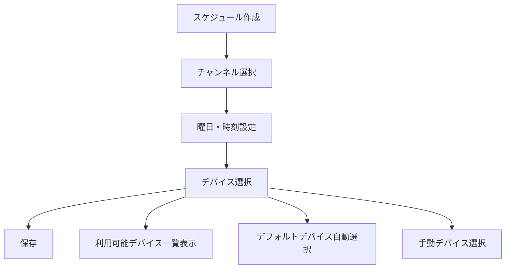
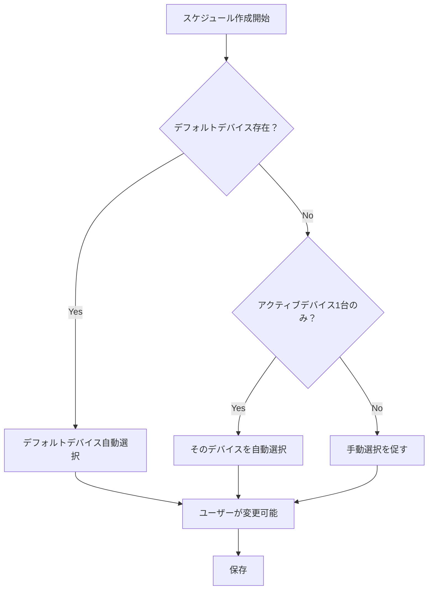
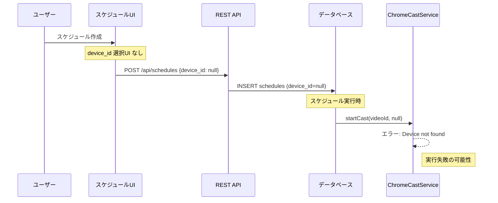
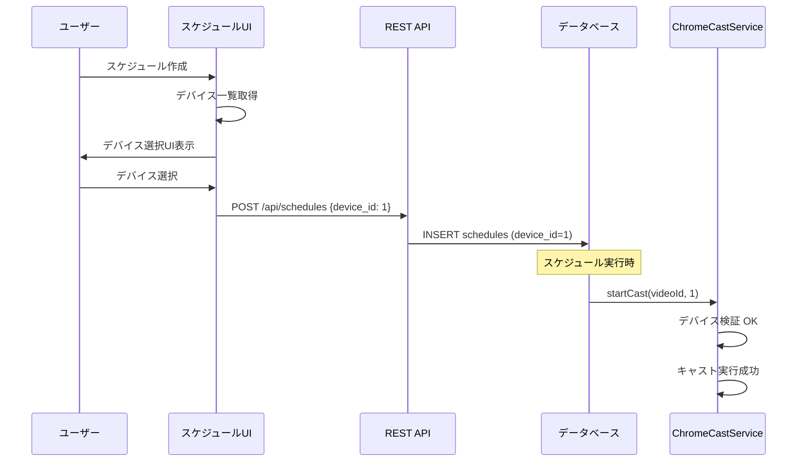

# YouTube自動Cast配信システム デバイス指定問題調査レポート

**調査日時**: 2025年6月9日  
**調査者**: Claude (Anthropic)  
**対象システム**: YouTube自動Cast配信システム v1.0

## 概要

本レポートは、YouTube自動Cast配信システムにおけるChromeCastデバイス指定機能の問題を調査した結果をまとめたものです。READMEとDEVELOPMENT_LOG.mdを参照し、システム全体のコードベースを分析して問題点を特定しました。

## 調査対象ファイル

| ファイル種別 | ファイルパス | 調査内容 |
|-------------|-------------|----------|
| ドキュメント | [`README.md`](../README.md) | システム概要、機能仕様 |
| 開発ログ | [`DEVELOPMENT_LOG.md`](../DEVELOPMENT_LOG.md) | 開発履歴、問題解決履歴 |
| バックエンド | [`server/src/services/ChromeCastService.js`](../server/src/services/ChromeCastService.js) | ChromeCast制御ロジック |
| フロントエンド | [`client/src/routes/Devices.svelte`](../client/src/routes/Devices.svelte) | デバイス管理UI |
| フロントエンド | [`client/src/routes/Schedules.svelte`](../client/src/routes/Schedules.svelte) | スケジュール管理UI |
| データベース | [`server/database/schema.sql`](../server/database/schema.sql) | データベース設計 |
| API | [`server/src/controllers/api.js`](../server/src/controllers/api.js) | REST API実装 |

## 🚨 発見された問題

### 1. **重大問題**: スケジュール管理でのデバイス選択UI不足

#### 問題の詳細
- **ファイル**: [`client/src/routes/Schedules.svelte`](../client/src/routes/Schedules.svelte):136, 376
- **状況**: スケジュール作成・編集フォームにデバイス選択機能が実装されていない
- **影響**: ユーザーがスケジュール作成時にキャスト先デバイスを指定できない

```javascript
// 問題のコード: device_id は設定されているが選択UIがない
editingSchedule = {
    channel_id: '',
    channel_name: '',
    day_of_week: 1,
    start_time: '09:00',
    duration_minutes: 120,
    device_id: null,  // ← 常にnullのまま
    is_active: true
};
```

#### 期待される動作


### 2. **重大問題**: スケジュール一覧でのデバイス情報表示不足

#### 問題の詳細
- **ファイル**: [`client/src/routes/Schedules.svelte`](../client/src/routes/Schedules.svelte):444-481
- **状況**: スケジュール一覧で指定デバイスが表示されない
- **影響**: 既存スケジュールのデバイス指定状況が確認できない

```html
<!-- 問題: デバイス情報の列がない -->
<tbody class="bg-white divide-y divide-gray-200">
  {#each schedules as schedule}
    <tr>
      <td>チャンネル</td>
      <td>曜日・時刻</td>
      <td>配信時間</td>
      <td>状態</td>
      <!-- ← デバイス情報の列が不足 -->
      <td>操作</td>
    </tr>
  {/each}
</tbody>
```

### 3. **中程度問題**: デフォルトデバイス機能の未実装

#### 問題の詳細
- **データベース**: [`server/database/schema.sql`](../server/database/schema.sql):22 で `is_default` フィールドが定義済み
- **デバイス管理UI**: [`client/src/routes/Devices.svelte`](../client/src/routes/Devices.svelte):194-200 でデフォルト設定可能
- **問題**: スケジュール作成時にデフォルトデバイス自動選択機能が実装されていない

#### データベース設計（正常）
```sql
CREATE TABLE IF NOT EXISTS chromecast_devices (
    id INTEGER PRIMARY KEY AUTOINCREMENT,
    name TEXT NOT NULL UNIQUE,
    ip_address TEXT NOT NULL,
    port INTEGER DEFAULT 8009,
    is_default BOOLEAN DEFAULT false,  -- ← フィールド存在
    is_active BOOLEAN DEFAULT true,
    last_seen DATETIME,
    created_at DATETIME DEFAULT CURRENT_TIMESTAMP
);
```

#### 期待される自動選択ロジック


### 4. **軽微問題**: キャスト実行時のデバイス指定検証不足

#### 問題の詳細
- **ファイル**: [`server/src/services/ChromeCastService.js`](../server/src/services/ChromeCastService.js):115-120
- **状況**: device_id が null の場合のフォールバック処理が不十分
- **影響**: スケジュール実行時にデバイス指定なしでエラーになる可能性

```javascript
// 現在の実装
async startCast(videoId, deviceId, scheduleId = null) {
    try {
        const device = await this.getDevice(deviceId);
        if (!device) {
            throw new Error(`Device with ID ${deviceId} not found`);
            // ← deviceId が null の場合のフォールバック処理なし
        }
        // ...
    }
}
```

#### 推奨されるフォールバック処理
```javascript
async startCast(videoId, deviceId, scheduleId = null) {
    try {
        let device;
        
        if (deviceId) {
            device = await this.getDevice(deviceId);
        }
        
        if (!device) {
            // フォールバック: デフォルトデバイスを検索
            device = await this.database.get(
                'SELECT * FROM chromecast_devices WHERE is_default = 1 AND is_active = 1'
            );
        }
        
        if (!device) {
            // 最終フォールバック: 最初のアクティブデバイス
            device = await this.database.get(
                'SELECT * FROM chromecast_devices WHERE is_active = 1 LIMIT 1'
            );
        }
        
        if (!device) {
            throw new Error('No available ChromeCast device found');
        }
        // ...
    }
}
```

## 📊 システム影響度分析

### 現在のデータフロー



### あるべきデータフロー



## 🛠️ 解決策の提案

### 優先度 1: スケジュール管理UIの拡張

#### 1.1 デバイス選択フィールドの追加

**対象ファイル**: [`client/src/routes/Schedules.svelte`](../client/src/routes/Schedules.svelte)

```svelte
<!-- 追加が必要なUI要素 -->
<div>
  <label class="block text-sm font-medium text-gray-700 mb-1">キャストデバイス</label>
  <select
    bind:value={editingSchedule.device_id}
    class="w-full px-3 py-2 border border-gray-300 rounded-md focus:outline-none focus:ring-2 focus:ring-blue-500"
    required
  >
    <option value="">デバイスを選択してください</option>
    {#each availableDevices as device}
      <option value={device.id}>
        {device.name} ({device.ip_address})
        {device.is_default ? ' [デフォルト]' : ''}
      </option>
    {/each}
  </select>
</div>
```

#### 1.2 スケジュール一覧でのデバイス情報表示

```svelte
<!-- テーブルヘッダーに追加 -->
<th class="px-6 py-3 text-left text-xs font-medium text-gray-500 uppercase tracking-wider">
  キャストデバイス
</th>

<!-- テーブル行に追加 -->
<td class="px-6 py-4 whitespace-nowrap text-sm text-gray-900">
  {schedule.device_name || 'デバイス未指定'}
  {#if schedule.is_default_device}
    <span class="text-xs text-blue-600">[デフォルト]</span>
  {/if}
</td>
```

### 優先度 2: API層の拡張

#### 2.1 デバイス情報付きスケジュール取得

**対象ファイル**: [`server/src/controllers/api.js`](../server/src/controllers/api.js):7-15

```javascript
// 修正が必要なクエリ
router.get('/schedules', async (req, res) => {
    try {
        const schedules = await database.all(`
            SELECT 
                s.*,
                d.name as device_name,
                d.is_default as is_default_device,
                d.is_active as device_is_active
            FROM schedules s
            LEFT JOIN chromecast_devices d ON s.device_id = d.id
            ORDER BY s.day_of_week, s.start_time
        `);
        res.json(schedules);
    } catch (error) {
        console.error('Get schedules error:', error);
        res.status(500).json({ error: error.message });
    }
});
```

### 優先度 3: ChromeCastService のフォールバック機能

#### 3.1 デバイス自動選択ロジック

**対象ファイル**: [`server/src/services/ChromeCastService.js`](../server/src/services/ChromeCastService.js):115

```javascript
async getTargetDevice(deviceId) {
    let device;
    
    // 1. 指定されたデバイスを検索
    if (deviceId) {
        device = await this.getDevice(deviceId);
        if (device) return device;
    }
    
    // 2. デフォルトデバイスを検索
    device = await this.database.get(
        'SELECT * FROM chromecast_devices WHERE is_default = 1 AND is_active = 1'
    );
    if (device) return device;
    
    // 3. 最初のアクティブデバイスを選択
    device = await this.database.get(
        'SELECT * FROM chromecast_devices WHERE is_active = 1 ORDER BY last_seen DESC LIMIT 1'
    );
    if (device) return device;
    
    throw new Error('No available ChromeCast device found');
}
```

## 📈 実装計画

### フェーズ 1: 緊急対応（1-2日）
1. **スケジュール管理UIの修正**
   - デバイス選択フィールド追加
   - デバイス一覧取得ロジック追加
   - 基本的な選択機能実装

### フェーズ 2: 機能拡張（3-5日）
1. **デフォルトデバイス自動選択**
   - フロントエンド側でのデフォルト選択
   - バックエンド側でのフォールバック処理
2. **スケジュール一覧での情報表示**
   - API修正（JOIN クエリ）
   - UI表示拡張

### フェーズ 3: UX改善（1週間）
1. **高度なデバイス管理機能**
   - デバイス接続状態リアルタイム表示
   - デバイス選択時の接続テスト
   - 複数デバイス管理機能

## 🧪 テストケース

### 機能テスト
| テストケース | 期待結果 | 優先度 |
|-------------|----------|--------|
| デバイス未選択でスケジュール作成 | バリデーションエラー | 高 |
| デフォルトデバイスがある状態でスケジュール作成 | 自動選択される | 高 |
| 無効なデバイスでスケジュール実行 | フォールバック実行 | 高 |
| スケジュール一覧でデバイス情報表示 | 正しく表示される | 中 |

### 統合テスト
| シナリオ | 期待結果 |
|---------|----------|
| デバイス1台のみの環境 | 自動選択・実行成功 |
| 複数デバイス環境 | 指定デバイスで実行 |
| デバイス切断中の実行 | 他デバイスへフォールバック |

## 📝 結論

### 重要度の高い問題
1. **スケジュール作成時のデバイス選択機能不足** - システムの基本機能に影響
2. **デバイス指定なしでの実行失敗リスク** - 自動化の信頼性に影響

### 推奨対応順序
1. 緊急対応: スケジュールUIのデバイス選択機能追加
2. 安定化: フォールバック機能実装
3. 改善: UX向上とエラーハンドリング強化

### 長期的な改善提案
- 複数デバイス同時キャスト機能
- デバイス健全性監視機能
- 負荷分散機能

---

**調査完了**: 2025年6月9日 10:53  
**次のアクション**: フェーズ1の実装開始を推奨